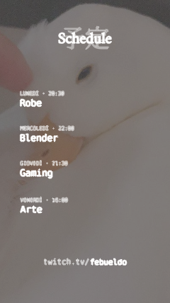

# Schedule


### Requirements

You need to install `python3` and [`manim`](https://github.com/3b1b/manim).
If you want to run the code as is you need
[Consolas](https://learn.microsoft.com/en-US/typography/font-list/consolas) font too, as required by `manimlib` and
[Noto Sans JP](https://fonts.google.com/noto/specimen/Noto+Sans+JP) and
[Amiri](https://fonts.google.com/noto/specimen/Amiri).


### Run

```manimgl schedule.py Schedule```

The output should produce something like that:



[assets/output/Schedule.png](assets/output/Schedule.png)


[assets/output/Schedule.mp4](assets/output/Schedule.mp4)
